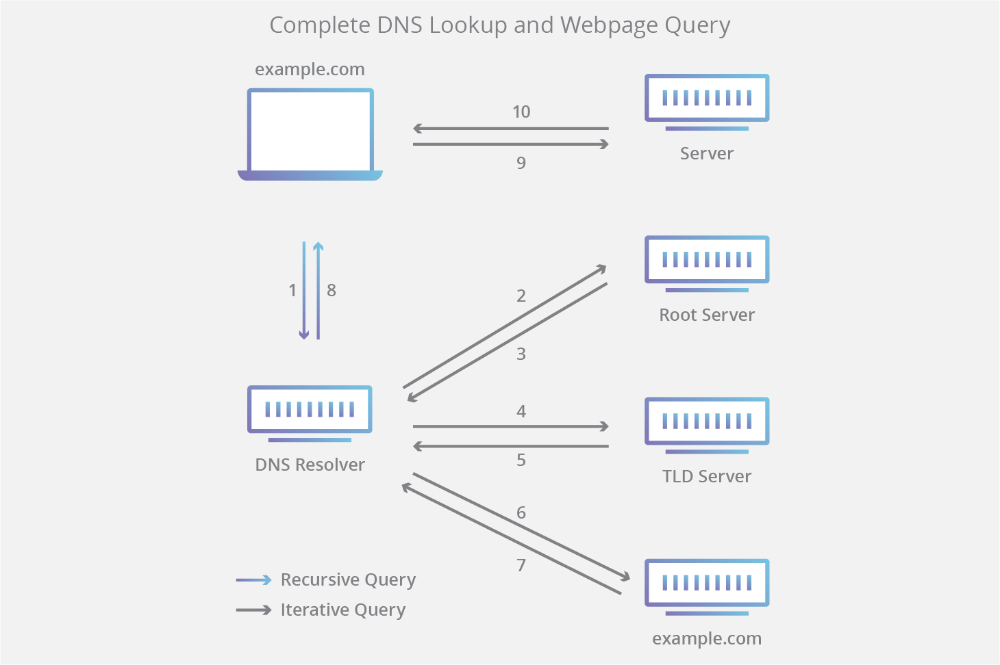

# **The Domain Name System (DNS)**
Je telefonski imenik interneta. Ljudje dostopajo do informacij na spletu prek imen domen, kot sta google.com ali youtube.com. Spletni browseri, pa komunicirajo prek naslovov internetnega protokola (IP). DNS prevede imena domen v naslove IP, tako da lahko browseri naložijo pravilne spletne strani.
 
 
## **DNS serverji**
 
- **DNS recursor** - je server, zasnovan za sprejemanje queryjev iz odjemalskih strojev prek aplikacij, kot so spletni browseri in izsledovanje pravilnega IP-ja.
- **Root nameserver** - je prvi korak pri prevajanju človeku berljivih imen domen v IP naslove. Lahko si ga predstavljamo kot kazalo v knjižnici, ki kaže na različne police s knjigami - običajno služi kot referenca na druge bolj specifične lokacije.
- **TLD nameserver** - je naslednji korak pri iskanju določenega naslova IP in gosti zadnji del imena gostitelja (v example.com je server TLD »com«). Lahko si ga predstavljamo kot posebno polico s knjigami v knjižnici.
- **Authoritative nameserver** - je zadnja postaja v poizvedbi imenskega servera. Če ima avtoritativni imenski server dostop do zahtevanega zapisa, bo naslov IP za zahtevano ime gostitelja vrnil DNS Recursorju , ki je podal prvotno zahtevo. Lahko si ga predstavljamo kot slovar na stojalu s knjigami, v katerem je mogoče določeno ime prevesti v njegovo definicijo.

## **Koraki pri DNS lookupu**

1. Uporabnik v browser vnese 'example.com' in query potuje v internet ter jo prejme DNS resolver.
2. Resolver nato poizveduje po korenskem imenskem serveru DNS.
3. Korenski server se nato odzove razreševalniku z naslovom Top Level Domain (TLD) DNS serverja (kot je .com ali .net), ki shranjuje podatke za svoje domene. Pri iskanju example.com je naša zahteva usmerjena proti vrhnji domeni .com.
4. Resolver nato pošlje zahtevo vrhnji domeni.com.
5. Server TLD nato odgovori z naslovom IP imenskega serverja domene, example.com.
6. Nazadnje Resolver pošlje poizvedbo imenskemu serveru domene.
7. Naslov IP za example.com se nato iz imenskega serverja vrne v razreševalnik.
8. Resolver se nato odzove spletnemu browserju z IP naslovom prvotno zahtevane domene. Ko 8 korakov iskanja DNS vrne IP naslov za example.com, lahko browser izvede zahtevo za spletno stran
9. Browser pošlje zahtevo HTTP na IP naslov.
10. Server na tem IP naslovu vrne spletno stran, ki bo renderana v browserju

## **Tipi DNS queryjev**

Pri tipičnem iskanju DNS se pojavijo tri vrste queryjev. Z uporabo kombinacije teh queryjev lahko optimiziran postopek za razrešitev DNS povzroči zmanjšanje časa iskanja. V idealni situaciji bodo na voljo cacheani zapisni podatki, kar bo imenskemu strežniku DNS omogočilo vrnitev nerekurzivne poizvedbe.

- **Recursive query** - V rekurzivnem queryju DNS recursor zahteva, da server DNS (običajno rekurzivni resolver) odjemalcu odgovori z zahtevanim zapisom vira ali error-jem, če resolver ne najde zapisa.
- **Iterative query** - V tej situaciji bo odjemalec DNS serverju omogočil, da vrne najboljši odgovor, ki ga lahko. Če poizvedovani strežnik DNS nima ujemanja z imenom poizvedbe, bo vrnil napotitev na strežnik DNS, ki je avtoritateten za nižjo raven imenskega prostora domene. Odjemalec DNS bo nato izvedel query na referenčni naslov. Ta postopek se nadaljuje z dodatnimi strežniki DNS po verigi poizvedb, dokler ne pride do napake ali časovne omejitve.
- Non-recursive query - običajno se to zgodi, ko odjemalec DNS resolver querry-ja DNS server za zapis, do katerega ima dostop bodisi zato, ker je avtoritateten za zapis bodisi ker zapis obstaja v njegovem predpomnilniku. Običajno bo strežnik DNS cashe-jal zapise DNS, da prepreči dodatno porabo bandwidtha in obremenitev na zgornjih serverjih.

## **DNS caching**

- **Caching** - je začasno shranjevanje podatkov na mestu, kar ima za posledico izboljšanje zmogljivosti in zanesljivosti requestov. DNS caching vključuje shranjevanje podatkov bližje odjemalcu tako, da je DNS query mogoče razrešiti prej in se je mogoče izogniti dodatnim poizvedbam nižje v iskalni verigi, s čimer se izboljšajo časi nalaganja in zmanjša poraba pasovne širine/CPE. Podatke DNS je mogoče shraniti v predpomnilnik na različnih lokacijah, od katerih bo vsaka shranila zapise DNS za določen čas, ki ga določa čas življenja (TTL - time-to-live).

- **Lokacije DNS cachinga:**
	- ***Browser DNS caching*** - Sodobni browserji so privzeto zasnovani za caching zapisov za določen čas. Ko je podan request za zapis iz DNS serverja, je predpomnilnik browserja prva lokacija, na kateri se preveri zahtevani zapis.
	- ***Operating system (OS) level DNS caching*** - DNS resolver na ravni operacijskega sistema je drugi in zadnji lokalni postanek, preden DNS query zapusti računalnik. Proces znotraj vašega operacijskega sistema, ki je zasnovan za obravnavo te poizvedbe, se običajno imenuje “stub resolver” ali DNS client. Ko DNS client prejme zahtevo od aplikacije, najprej preveri svoj predpomnilnik, da vidi, ali ima zapis. Če nima, pošlje DNS query (z nastavljeno rekurzivno zastavico) zunaj lokalnega omrežja rekurzivnemu razreševalniku DNS znotraj ponudnika internetnih storitev (ISP).
	