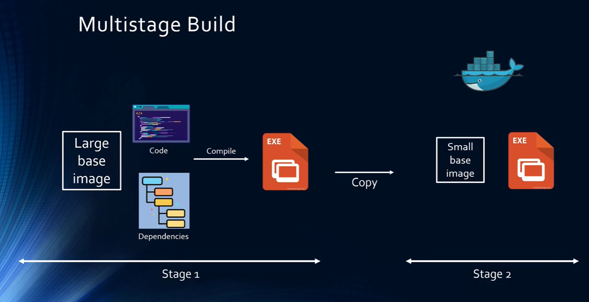

# **Docker**

## **Kaj je Docker?**

Docker je orodje, ki omogoča razvijalcem, sistemskim skrbnikom itd., da enostavno namestijo svoje aplikacije v sandbox (imenovanem container), da se izvajajo v gostiteljskem operacijskem sistemu, tj. Linuxu. Ključna prednost Dockerja je, da uporabnikom omogoča pakiranje aplikacije z vsemi njenimi odvisnostmi v standardizirano enoto za razvoj programske opreme. Za razliko od virtualnih strojev, containerji nimajo velikih stroškov in zato omogočajo učinkovitejšo uporabo osnovnega sistema in resourcov.

## **Docker image**

Docker image je lahek, samostojen, izvedljiv paket programske opreme, ki vključuje vse, kar je potrebno za zagon aplikacije: kodo, čas izvajanja, sistemska orodja, sistemske knjižnice in nastavitve.

Imagi postanejo containerji ko izvedemo ukaz `docker run`.

## **Docker container**

Container je standardna enota programske opreme, ki pakira kodo in vse njene odvisnosti, tako da aplikacija deluje hitro in zanesljivo iz enega računalniškega okolja v drugega.

### **Vrste contaierjov:**

- ***Standard***: Docker je ustvaril industrijski standard za containerje, tako da jih je mogoče prenašati kamor koli

- ***Loghtweight***: containerji si delijo OS kernel stroja in zato ne potrebujejo operacijskega sistema za aplikacijo, kar spodbuja večjo učinkovitost serverja ter zmanjšuje stroške serverja in licenc

- ***Secure***: aplikacije so varnejše v containerjih in Docker zagotavlja najmočnejše privzete izolacijske zmogljivosti v industriji

## **Multistage build**

Ena najzahtevnejših stvari pri ustvarjanju imagov je zmanjševanje njihovih velikosti. Vsako navodilo RUN, COPY in ADD v datoteki Dockerfile sliki doda plast in ne pozabite počistiti vseh artefaktov, ki jih ne potrebujete, preden se premaknete na naslednji layer. Če želite napisati res učinkovito datoteko Dockerfile, ste tradicionalno morali uporabljati različne trike v shellu in drugo logiko, da so layerji čim manjše in da zagotovite, da ima vsaka plast artefakte, ki jih potrebuje iz prejšnjega layerja, in nič drugega.

Pri multistage buildu uporabimo več FROM stavkov v datoteki Dockerfile. Vsako navodilo FROM lahko uporablja drugačno osnovo in vsako od njih začne novo stopnjo gradnje. Artefakte lahko selektivno kopirate iz ene stopnje v drugo in pustimo za seboj vse, česar ne želite na končnemu imagu.

Ubistvu iz prvega imaga vzamemo samo pomembne stvari kot so .exe datoreka ipd., in jih preselimo v nov image, ki ima manjši base image.

