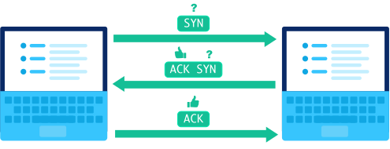
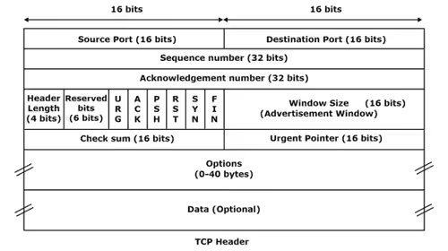

# **HTTP protokol**

## **Kaj se zgodi ko v browser napišemo link?**

- Browser poišče IP serverja, na katerega se mora povezati s pomočjo DNS lookupa
- Browser z serverjom vzpostavi TCP povezavo
- Ko je povezava vzpostavljena pošlje serverju HTTP request
- Ko server request sprocesira, pošlje nazaj response, ki vsebuje:
	- **Status line** (Vsebuje različico HTTP ter številčno in besedilno predstavitev statusa requesta (Status code))
	- **Response headerje** (Te povejo browserju kako naj ravna z responsom)
	- **Vsebino fila** (HTML, CSS, Javascript, slike, podatke in podobno)
- Ko browser prejme response od serverja, pregleda response headerje za informacije o tem, kako renderati vsebino.

## **TCP**

- **Potek**:
	- ***Vzpostavljanje povezave z three-way handshakom*** - Prvi računalnik pošlje paket z bitom SYN, nastavljenim na 1 (SYN = "synchronize?"). Server pošlje nazaj paket z bitom ACK, nastavljenim na 1   (ACK = "acknowledge!") in bitom SYN, nastavljenim na 1. Prvi računalnik odgovori z ACK. Trije paketki, vključeni v three-way handshaku, ne vključujejo nobene vsebine. Ko računalniki končajo z handshakom, so pripravljeni na sprejem paketkov, ki vsebujejo dejanske podatke in vssebino.
	- ***Pošiljanje paketkov z podatki in vsebino*** - Server pošlje paketek s podatki in sequence numberjom. Računalnik ga potrdi tako, da nastavi bit ACK in potrditveno številko poveča za dolžino prejetih podatkov.
	- ***Prekinitev povezave*** - Računalnik začne prekinitev povezave tako, da pošlje paket z bitom FIN, nastavljenim na 1 (FIN = finish). Server odgovori z ACK in drugim FIN. Po še enem ACK-u iz računalnika se povezava prekine.

		
	
- **Zaznavanje izgubljenih paketov** - Po pošiljanju paketka pošiljatelj zažene časovnik in ga postavi v čakalno vrsto za ponovno pošiljanje. Če se časovnik izteče in pošiljatelj še ni prejel ACK od prejemnika, ponovno pošlje paket.

- **Ravnanje z out of order paketki** - Ko prejemnik vidi višji sequence number od tistega, ki bi moral biti naslednji, ve, da mu manjka vsaj en paket vmes. Npr. prejemnik vidi zaporedno številko #73, pričakuje pa zaporedno številko #37. Prejemnik sporoči pošiljatelju, da je nekaj narobe, tako da pošlje paket s potrditveno številko, nastavljeno na pričakovan sequence number. (Lahko se zgodi, da manjkajoči paketek  vzame počasnejšo pot po internetu in prispe kmalu zatem, lahko pa je paketek v celoti izgubljen.

- **TCP headerji**:
	- ***Transmission Control Protocol (TCP) header*** - je prvih 24 bajtov segmenta TCP, ki vsebuje parametre in stanje end-to-end TCP socketa. TCP header spremlja stanje komunikacije med dvema končnima točkama TCP.

	- ***Sestava***:
		- **Source port** (Določa številko porta aplikacijskega programa v gostitelju pošiljatelja. Source port je velik 16 bitov)
		- **Destination port** (Določa številko porta aplikacijskega programa v gostitelju prejemnika. Destination port je velik 16 bitov)
		- **Sequence number** (Prejemnemu gostitelju sporoči, kateri oktet v tem zaporedju obsega prvi bajt v segmentu. Zaporedna številka je 32-bitno polje. TCP vsakemu bajtu podatkov v segmentu dodeli edinstveno zaporedno številko)
		- **Acknowledgement number** (Podaja zaporedno številko naslednjega okteta, ki ga prejemnik pričakuje. Potrditvena številka je 32-bitno polje. Med trismernim rokovanjem se request segment pošlje za vzpostavitev povezave)
		- **HLEN** (To polje določa število 32-bitnih besed v TCP headerju. To polje pomaga prejemniku vedeti, od kod se začnejo dejanski podatki. Polje HLEN je 4-bitno in obsega od 20 bajtov do 60 bajtov v TCP headerju)
		- **Control Flag Bits** (Velikost tega segmenta je 6 bitov, razdeljen j pa na sledeča polja:
			- ***URG*** (Urgent pointer) - Če je URG = 1, je urgent pointer v uporabi
			- ***ACK*** (Acknowledgement)- Če je ACK = 1, pomeni, da je acknowledgement number veljavna, če pa je ACK = 0, pomeni, da segment ne vsebuje acknowledgementa
			- ***PSH*** (Push the data without buffering) - Če je PSH = 1, pomeni da request potisne podatke v aplikacijo brez bufferanja
			- ***RST*** (Reset) - Če je RST = 1, pomeni, da nenadoma ponastavi povezavo vsakič, ko pride do zrušitve gostitelja ali pa se uporabi za zavrnitev segmenta.
			- ***SYN*** (Synchronize) = Uporabljen za vspostavljanje povezave v three-way handshaku)
		- **Window size** (Pove, koliko bajtov se lahko pošlje, začne pa se z bytom acknowledge. Pove, koliko podatkov (v bajtih) lahko pošiljatelj prejme brez acknowledgementa)
		- **Checksum** (Uporablja se za odkrivanje napak. Preverja podatkoe, headerje in psevdo-headerje. Pošiljatelj doda kontrolno vsoto CRC v polje kontrolne vsote, preden pošlje podatke. Sprejemnik zavrne podatke, ki ne prestanejo preverjanja CRC.
		- **Options** (The options field is used for several purposes. The options field contains 40 bytes of information.)

			

## **HTTP requesti**

- **HTTP request** - vsebuje request line, headerje (ali metadata requesta) in body.
	- ***Request line*** - vsebuje informacije, ki jih server lahko uporabi za določitev, kaj želi narediti odjemalec (npr. browser). Vsebina:
		- metoda requesta, ki je ena od GET, POST, PUT, PATCH, DELETE in še nekaj drugih
		- pot, ki kaže na zahtevane vire
		- različico HTTP za komunikacijo
	
		(Primer: `GET /hello-world HTTP/1.1`)
		
- **Status kode** - Statusna koda pove stanje requesta, vključena pa je v status line-u responsa. Prva številka vsake trimestne statusne kode se začne z eno od petih številk, od 1 do 5; to lahko vidimo izraženo kot 1xx ali 5xx. Vsak od teh obsegov zajema drugačen razred odziva serverja:
	- ***1xx*** (Informational responses) - Server premišljuje o requestu
	- ***2xx*** (Success!) - Request je bil uspešno zaključen in server je browserju dal pričakovan response
	- ***3xx*** (Redirection) - Request je bil prejet, vendar obstaja nekakšna preusmeritev.
	- ***4xx*** (Client errors) - Request je bil vložen, a stran ni veljavna – to je napaka na strani spletnega mesta in se pogosto prikaže, ko spletna stran ne obstaja.(Page not found. ; The site or page couldn’t be reached.)
	- ***5xx*** (Server errors) - Odjemalec je poslal veljavno zahtevo, vendar server zahteve ni uspel dokončati.