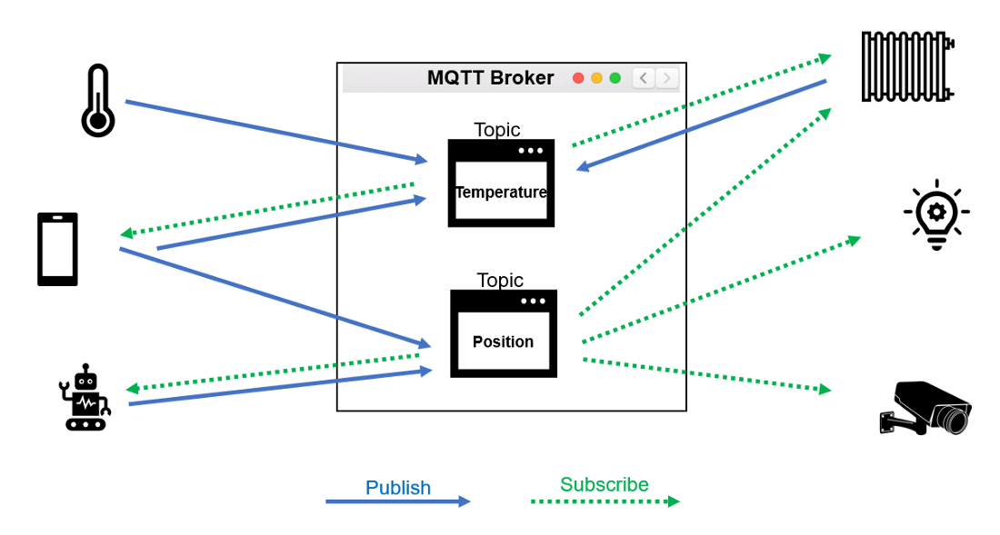

# **MQ Telemetry Transport (MQTT)**

MQTT je odprt in preprost protokol za publish/subscribe prenos sporočil, zasnovan za machine-to-machine komunikacijo med različnimi napravami v okoljih z visokim latency-jom in nizkim bandwidth-om omrežja.

## **Publish/subscribe**

Naprave se med seboj ne pogovarjajo, namesto tega pa je komunikacija strukturirana v topike in vodena prek centralnega strežnika (broker).

Naprave lahko objavijo informacije v enemu ali več topikih. Hkrati pa se lahko naročijo na enega ali več topikov za prejemanje informacij, ki so tam objavljene. To omogoča one-to-many distribucijo sporočil in ločevanje aplikacij.

## **Latency in bandwidth**

Protokol MQTT je lahek, učinkovit in ima le majhen odtis. Zaradi tega se odlično ujema z napravami IoT, ki pogosto delujejo v nestabilnih okoljih in uporabljajo brezžične povezave, kot so WiFi, Bluetooth ali satelit.