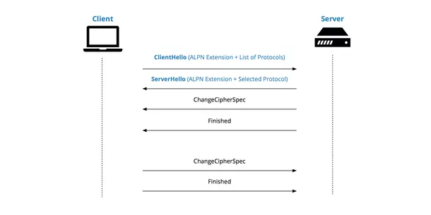

# **Transport Layer Security (TLS)**

Je široko sprejet varnostni protokol, zasnovan za zagotavljanje zasebnosti in varnosti podatkov pri komunikaciji prek interneta. Primarni primer uporabe TLS je šifriranje komunikacije med spletnimi aplikacijami in strežniki, na primer spletni brskalniki, ki nalagajo spletno mesto. TLS se lahko uporablja tudi za šifriranje drugih komunikacij, kot so e-pošta, sporočila in glas prek IP-ja (VoIP).

## **Razlika med TLS in HTTPS**

HTTPS je implementacija TLS-ja na protokol HTTP, ki ga uporabljajo vsa spletna mesta in tudi nekatere druge spletne storitve. Vsako spletno mesto, ki uporablja HTTPS, torej uporablja šifriranje TLS.

## **Kaj TLS dela**

Protokol TLS ima tri glavne komponente: šifriranje, avtentikacijo in preverjanje integritete.

- ***Šifriranje***: skrije podatke, ki se prenašajo od drugje.
- ***Avtentikacija***: zagotavlja, da so stranke, ki izmenjujejo informacije, tiste, za katere se predstavljajo.
- ***Preverjanje integritete***: preverja, če so bili podatki ponarejeni ali spremenjeni.

## **Kako TLS deluje**

Da spletno mesto ali aplikacija uporablja TLS, mora imeti TLS certifikat nameščen na izvornem serverju (certifikat je znan tudi kot "SSL certifikat"). Potrdilo TLS izda potrjevalec certifikatov osebi ali podjetju, ki je lastnik domene. Certifikat vsebuje pomembne informacije o tem, kdo je lastnik domene, skupaj z javnim ključem serverja, ki sta pomembna za preverjanje njegove identitete.

Povezava TLS se začne z postopkom, znanim kot TLS handshake. Ko uporabnik obišče spletno mesto, ki uporablja TLS, se začne handshake med uporabnikovo napravo (znano tudi kot odjemalska naprava) in spletnim strežnikom.

Med TLS handshakom uporabnikova naprava in spletni strežnik:

- Določita, katera različica TLS (TLS 1.0, 1.2, 1.3 itd.) bo uporabljena
- Odločita se, kateri cipher suiti bodo uporabljeni
- Preverita pristnost serverja s TLS certifikatom
- Ustvarit session keye za šifriranje sporočil med njima po končanem handshaku

## **SNI (Server Name Indication)**

SNI je razširitev za TLS (prej znan kot SSL), ki se uporablja v HTTPS. Vključen je v postopek TLS handshake, da zagotovi, da odjemalske naprave vidijo pravilni SSL certifikat za spletno mesto, ki ga poskušajo doseči. Razširitev omogoča določitev imena gostitelja ali imena domene spletnega mesta med rokovanjem TLS, namesto ko se HTTP povezava odpre po handshaku.

SNI preprečuje "common name mismatch error": ko naprava uporabnika doseže pravi IP naslov za spletno mesto, vendar se ime na SSL certifikatu ne ujema z imenom spletnega mesta. Pogosto se zaradi te vrste napak v brskalniku uporabnika prikaže sporočilo o napaki "Vaša povezava ni zasebna"

## **Application-Layer Protocol Negotiation (ALPN)**

ALPN ali Application-Layer Protocol Negotiation je TLS razširitev, ki vključuje pogajanja o protokolu v okviru "hello" sporočil. ALPN se lahko pogaja, kateri protokol naj se uporabi prek varne povezave na način, ki je učinkovitejši in se izogne ​​dodatnemu iskanju. Protokol HTTP/2, ki je vedno bolj priljubljen, uporablja ALPN za skrajšanje časa nalaganja spletnega mesta in hitrejše šifriranje povezav.

ALPN deluje tako, da bo odjemalec (client) serverju poslal seznam podprtih aplikacijskih protokolov kot del sporočila "ClientHello". Server nato izbere protokol in ta protokol pošlje nazaj v svojem sporočilu "ServerHello". Izbiro protokola aplikacije je torej mogoče doseči z enim potovanjem znotraj TLS handshaka. Ta metoda tudi omogoča, da server poveže drugo potrdilo z vsakim aplikacijskim protokolom.

